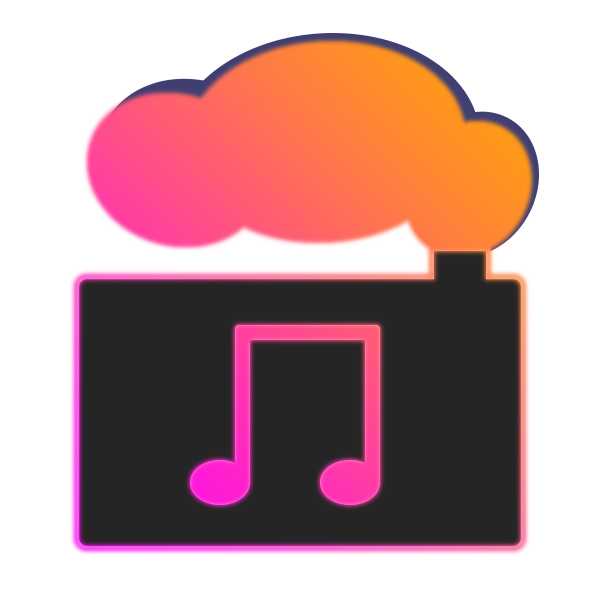

#SoundMachine

Simply - SoundMachine is a simple and featureful music playback application.

For users who are looking for a way to play the music on their computer without worrying
about the overhead of other modern counterparts, this application can be used to simply
listen to your local music collection.

For users that are looking for more, SoundMachine can be used to be a remote jukebox or
to stream your collection.

###Contents
- [Resources](#resources)
- [Building](#building)
- [Downloads](#downloads)

##Resources

Coming Soon

##Building

Coming Soon

##Downloads

Coming Soon
